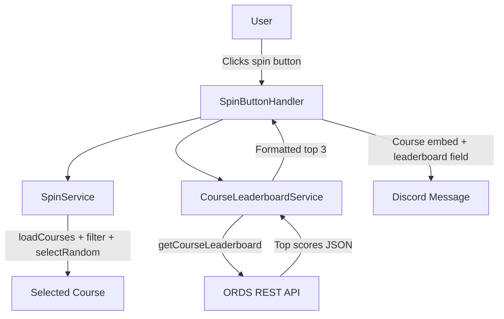
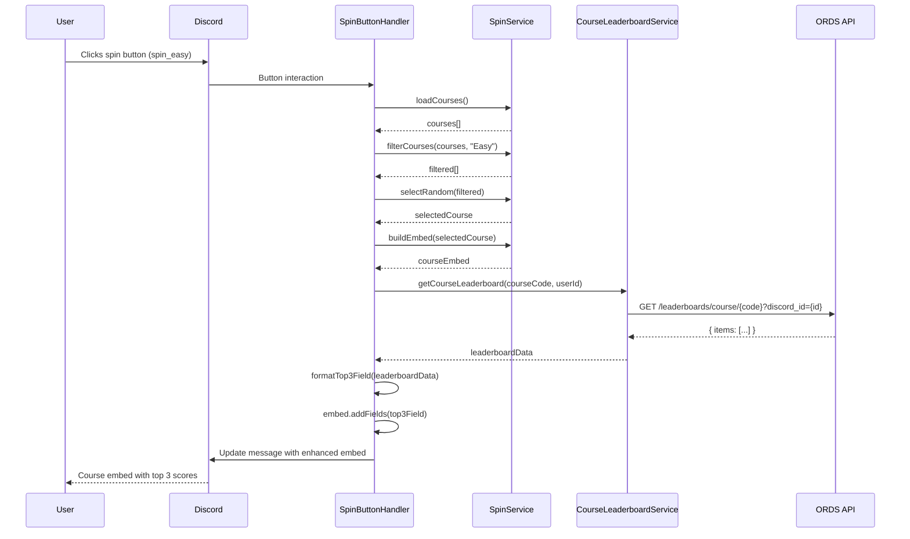
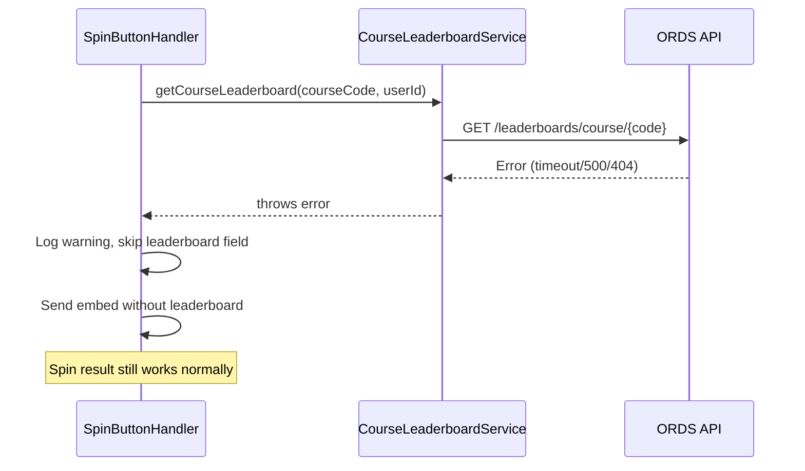

# Design Document: Spin Command Leaderboard

## Overview

The `/spin` command currently selects a random course and displays it as an embed with the course name, code, difficulty, and image. This enhancement adds the top 3 leaderboard scores for the selected course to the spin result, mirroring how the `/course` command presents best scores. The leaderboard data is fetched from the existing ORDS REST API endpoint (`/leaderboards/course/{courseCode}`) using the `CourseLeaderboardService` which already handles authentication, caching, and error handling.

The change is scoped to `SpinButtonHandler` — after selecting a random course, it fetches leaderboard data for that course and appends the top 3 scores as a field on the existing course embed. If the leaderboard fetch fails or returns no data, the spin result still displays normally without scores (graceful degradation).

## Architecture

The existing spin flow remains unchanged. The enhancement adds a leaderboard fetch step between course selection and embed display:





### Graceful Degradation Flow



## Components and Interfaces

### Component 1: SpinButtonHandler (Modified)

**File**: `bots/src/services/SpinButtonHandler.js`

**Purpose**: Handles spin button clicks. Enhanced to fetch and display top 3 leaderboard scores alongside the course result.

**Interface**:
```javascript
import { CourseLeaderboardService } from './CourseLeaderboardService.js';

export class SpinButtonHandler {
  constructor() {
    this.spinService = new SpinService();
    this.courseLeaderboardService = new CourseLeaderboardService();
    this.logger = logger.child({ service: 'SpinButtonHandler' });
    this.errorHandler = new ErrorHandler(this.logger);
  }

  /**
   * Handle a spin button click: select course, fetch leaderboard, display result.
   * @param {ButtonInteraction} interaction
   */
  async handleSpin(interaction) { /* ... */ }

  /**
   * Fetch top 3 leaderboard scores for a course.
   * Returns null on any failure (graceful degradation).
   * @param {string} courseCode - 3-letter course code (e.g., "ALE")
   * @param {string} userId - Discord user ID for highlighting
   * @returns {Promise<Object|null>} Formatted leaderboard data or null
   */
  async fetchTop3Leaderboard(courseCode, userId) { /* ... */ }

  /**
   * Format top 3 leaderboard scores into an embed field value string.
   * Shows top 3 distinct scores with medal emojis.
   * 1st place includes player name(s) (comma-delimited if tied).
   * 2nd and 3rd place show score only (no player names).
   * @param {Object} leaderboardData - Formatted data from CourseLeaderboardService
   * @returns {{ name: string, value: string, inline: boolean }|null} Embed field or null
   */
  formatLeaderboardField(leaderboardData) { /* ... */ }
}
```

**Responsibilities**:
- Instantiate `CourseLeaderboardService` alongside existing `SpinService`
- After building the course embed, call `fetchTop3Leaderboard` to get scores
- If leaderboard data is available, add a "🏆 Best Scores" field to the embed
- If leaderboard fetch fails or returns empty, send the embed without the field (no error shown to user)
- Format top 3 distinct scores with medal emojis (🥇🥈🥉):
  - 1st place: show score + player name(s), comma-delimited if multiple players tied
  - 2nd and 3rd place: show score only, no player names
- Group entries by distinct score to determine the 3 best scores

### Component 2: CourseLeaderboardService (Unchanged)

**File**: `bots/src/services/CourseLeaderboardService.js`

**Purpose**: Handles authenticated API calls to the leaderboard endpoint. Already provides `getCourseLeaderboard()` and `formatLeaderboardData()` methods.

**Interface** (existing, no changes):
```javascript
export class CourseLeaderboardService extends BaseAuthenticatedService {
  async getCourseLeaderboard(courseCode, userId) { /* ... */ }
  formatLeaderboardData(apiResponse, userId) { /* ... */ }
  formatLeaderboardLines(leaderboardData) { /* ... */ }
}
```

**Responsibilities**:
- Authenticate via OAuth2 client credentials
- Fetch leaderboard data from `/leaderboards/course/{courseCode}`
- Validate and format response data
- Handle retries, token refresh, and error classification

### Component 3: SpinService (Unchanged)

**File**: `bots/src/services/SpinService.js`

**Purpose**: Loads courses from JSON, filters by difficulty, selects random course, builds base embed.

**Interface** (existing, no changes):
```javascript
export class SpinService {
  async loadCourses() { /* ... */ }
  filterCourses(courses, difficulty) { /* ... */ }
  selectRandom(courses) { /* ... */ }
  buildEmbed(course) { /* ... */ }
}
```

## Data Models

### Leaderboard API Response (existing)

The ORDS endpoint `/leaderboards/course/{courseCode}` returns:

```javascript
{
  items: [
    { pos: 1, player_name: "PlayerA", score: -12, discord_id: "123...", isapproved: "true" },
    { pos: 2, player_name: "PlayerB", score: -11, discord_id: "456...", isapproved: "true" },
    { pos: 3, player_name: "PlayerC", score: -10, discord_id: "789...", isapproved: "true" },
    // ... more entries
  ],
  hasMore: true,
  count: 50
}
```

### Formatted Leaderboard Data (from CourseLeaderboardService.formatLeaderboardData)

```javascript
{
  course: { code: "ALE", name: "Alfheim", difficulty: "(Easy)" },
  entries: [
    { position: 1, playerName: "PlayerA", score: -12, discordId: "123...", isApproved: true, isCurrentUser: false },
    { position: 2, playerName: "PlayerB", score: -11, discordId: "456...", isApproved: true, isCurrentUser: true },
    { position: 3, playerName: "PlayerC", score: -10, discordId: "789...", isApproved: true, isCurrentUser: false }
  ],
  totalEntries: 50,
  userEntries: [{ position: 2, playerName: "PlayerB", score: -11, ... }],
  hasUserScores: true,
  lastUpdated: Date
}
```

### Top 3 Embed Field (new output from SpinButtonHandler)

The formatted field added to the spin result embed shows the top 3 distinct scores. Because multiple players can be tied at the same score, the display rules are:

1. **1st place (🥇)**: Show score + player name(s). If tied, show comma-delimited list of player names.
2. **2nd place (🥈)**: Show score only (no player names).
3. **3rd place (🥉)**: Show score only (no player names).

```javascript
// Example: No ties
{
  name: '🏆 Best Scores',
  value: '🥇 `-12` **PlayerA**\n🥈 `-11`\n🥉 `-10`',
  inline: false
}

// Example: Tie at 1st place
{
  name: '🏆 Best Scores',
  value: '🥇 `-12` **PlayerA, PlayerB**\n🥈 `-11`\n🥉 `-10`',
  inline: false
}

// Example: Only 1 distinct score available
{
  name: '🏆 Best Scores',
  value: '🥇 `-12` **PlayerA, PlayerB, PlayerC**',
  inline: false
}
```

- Medal emojis for positions 1-3 based on distinct scores (not player positions)
- Score displayed in fixed-width (backtick) formatting
- Only 1st place shows player names (bolded); 2nd and 3rd show score only
- Multiple players tied at 1st are shown as a comma-separated list

### Enhanced Spin Embed Structure

The final embed sent to Discord combines the existing course embed with the new leaderboard field:

| Field | Source | Example |
|-------|--------|---------|
| Title | SpinService.buildEmbed | `🟢 Alfheim — Easy` |
| Description | SpinService.buildEmbed | `` `ALE` `` |
| Image | SpinService.buildEmbed | Course image URL |
| Color | SpinService.buildEmbed | Green (Easy) or Blue (Hard) |
| Best Scores | SpinButtonHandler.formatLeaderboardField | 🥇 score + names, 🥈 🥉 scores only |
| Footer | SpinButtonHandler (existing) | `Result for: Random Easy` |

## Error Handling

### Error Scenario 1: Leaderboard API Unavailable

**Condition**: `CourseLeaderboardService.getCourseLeaderboard()` throws (timeout, 500, network error)
**Response**: Log a warning. Send the spin embed without the leaderboard field. The user still gets their random course — the leaderboard is a non-critical enhancement.
**Recovery**: Next spin attempt will retry the API call.

### Error Scenario 2: Leaderboard Returns Empty/No Scores

**Condition**: API returns successfully but `items` is empty (new course with no recorded scores)
**Response**: Skip adding the leaderboard field. No error shown to user.
**Recovery**: Scores will appear once players submit rounds for that course.

### Error Scenario 3: Authentication Token Expired

**Condition**: 401 response from leaderboard API
**Response**: `CourseLeaderboardService` handles token refresh internally with retries. If all retries fail, treat as API unavailable (Scenario 1).
**Recovery**: Token auto-refreshes on next request.

### Error Scenario 4: Course Not Found in Leaderboard API

**Condition**: 404 response (course code exists in local JSON but not in leaderboard system)
**Response**: Log info-level message. Send embed without leaderboard field.
**Recovery**: No action needed — some courses may not have leaderboard tracking.

## Testing Strategy

### Unit Testing Approach

- **fetchTop3Leaderboard**: Mock `CourseLeaderboardService.getCourseLeaderboard` and verify it returns formatted data limited to top 3 entries, or null on error
- **formatLeaderboardField**: Test with 0, 1, 2, and 3 distinct scores; verify medal formatting, score display, player names only on 1st place, and comma-delimited ties at 1st
- **handleSpin integration**: Mock both services, verify the embed includes the leaderboard field when data is available, and omits it when fetch returns null
- **Graceful degradation**: Verify that when `fetchTop3Leaderboard` throws, the spin still completes successfully with the course embed

### Property-Based Testing Approach

**Property Test Library**: fast-check

- **Leaderboard field never breaks embed**: For any valid leaderboard data (0-3 distinct scores with arbitrary score values and player names), `formatLeaderboardField` produces a string under Discord's 1024-character field limit
- **Top 3 ordering preserved**: For any leaderboard data, the formatted output maintains score ordering (best score first, then second best, then third best)
- **1st place always shows names**: For any non-empty leaderboard data, the first line always includes at least one player name

### Integration Testing Approach

- End-to-end spin flow with mocked ORDS API returning leaderboard data
- Verify the Discord embed contains both course info and top 3 scores
- Verify graceful degradation when API mock returns errors

## Performance Considerations

- The leaderboard API call adds latency to the spin response. Since `SpinButtonHandler` already uses `interaction.update()` (not deferred), the total response time must stay under Discord's 3-second interaction timeout.
- `CourseLeaderboardService` has built-in retry logic (up to 3 retries). For the spin context, we should limit to 1 retry or use a shorter timeout to avoid exceeding the interaction deadline.
- Consider using a reduced timeout (e.g., 5 seconds) for the leaderboard fetch within the spin handler to ensure the spin result is delivered promptly even if the API is slow.

## Security Considerations

- The leaderboard API requires OAuth2 authentication, which is already handled by `BaseAuthenticatedService` and the token manager.
- The `discord_id` parameter passed to the API is the interaction user's ID — no user impersonation risk since it comes from Discord's verified interaction payload.

## Dependencies

- `CourseLeaderboardService` — existing service, no changes needed
- `SpinService` — existing service, no changes needed
- `BaseAuthenticatedService` — existing base class providing OAuth2 auth
- `discord.js` v14.22.0 — `EmbedBuilder` (already used)
- `fast-check` — existing dev dependency for property tests
- `vitest` — existing test framework
