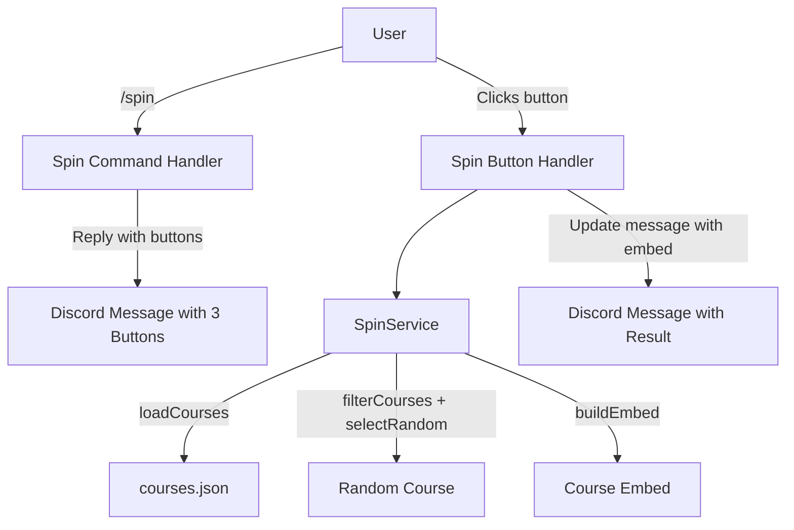
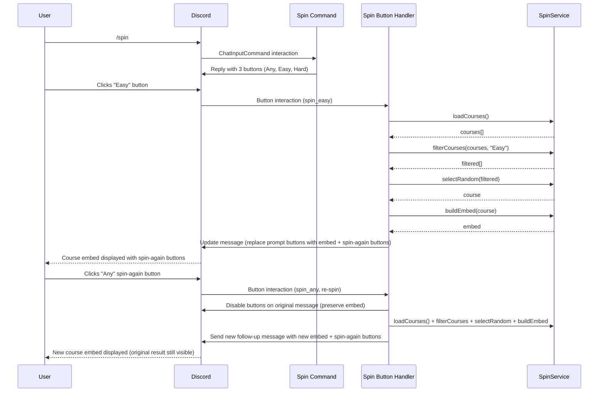

# Design Document: Spin Command UI Improvement

## Overview

The `/spin` command currently uses a slash command string option dropdown for difficulty filtering, which requires typing or navigating Discord's autocomplete UI. This redesign replaces the dropdown with a two-phase interaction: the command immediately responds with three buttons ("Any", "Easy", "Hard"), and clicking a button triggers the random course selection and displays the result. This provides a faster, more visual, and more intuitive experience that matches the existing button-based patterns used elsewhere in the bot (e.g., `RegistrationButtonHandler`).

The change is scoped to the command handler and a new button handler; `SpinService` remains unchanged since its `filterCourses`, `selectRandom`, and `buildEmbed` methods already support the needed operations.

## Architecture

The current architecture is a single slash-command interaction that defers, filters, picks, and replies. The new architecture introduces a two-step flow: an initial reply with buttons, followed by a button interaction that performs the spin.





## Components and Interfaces

### Component 1: Spin Command Handler (`bots/src/commands/spin.js`)

**Purpose**: Responds to `/spin` with an ephemeral message containing three difficulty buttons. No longer accepts a `difficulty` string option.

**Interface**:
```javascript
// SlashCommandBuilder — no options
export default {
  data: new SlashCommandBuilder()
    .setName('spin')
    .setDescription('Randomly select a Walkabout Mini Golf course'),

  async execute(interaction) { /* reply with button row */ }
}
```

**Responsibilities**:
- Build an `ActionRowBuilder` with three `ButtonBuilder` components
- Reply to the interaction (ephemeral) with the button row and a short prompt message
- No course logic — that moves to the button handler

### Component 2: Spin Button Handler (`bots/src/services/SpinButtonHandler.js`)

**Purpose**: Handles button clicks from the spin command, performs the spin, and updates the message with the result.

**Interface**:
```javascript
export class SpinButtonHandler {
  constructor() {
    this.spinService = new SpinService();
    this.logger = logger.child({ service: 'SpinButtonHandler' });
  }

  /**
   * @param {ButtonInteraction} interaction — the button click interaction
   * @returns {Promise<void>}
   */
  async handleSpin(interaction) { /* load, filter, pick, reply */ }
}
```

**Responsibilities**:
- Parse the difficulty from the button's `customId` (`spin_any`, `spin_easy`, `spin_hard`)
- Map `customId` to a difficulty value: `spin_any → null`, `spin_easy → "Easy"`, `spin_hard → "Hard"`
- Load courses via `SpinService.loadCourses()`
- Filter via `SpinService.filterCourses(courses, difficulty)`
- Pick via `SpinService.selectRandom(filtered)`
- Build embed via `SpinService.buildEmbed(selected)`
- Add a selected-difficulty indicator to the embed footer (e.g., "Random Any", "Random Easy", "Random Hard") based on the Custom_ID
- Add a Spin_Again_Buttons row to the result so users can re-spin without re-typing `/spin`
- On initial spin (from the `/spin` prompt): update the original message, replacing the difficulty buttons with the course embed + spin-again buttons
- On re-spin (from spin-again buttons): disable the buttons on the original message (preserving the course embed) and send a new follow-up message with the new result and fresh spin-again buttons — this prevents users from hiding previous results
- Handle errors (course load failure, empty filter results) with appropriate embeds

### Component 3: Interaction Router (`bots/src/index.js`)

**Purpose**: Routes `spin_*` button interactions to `SpinButtonHandler`.

**Interface change**: Add routing in the existing `interactionCreate` handler for message components.

```javascript
// In the existing component interaction handler:
if (interaction.isButton() && interaction.customId.startsWith('spin_')) {
  await this.spinButtonHandler.handleSpin(interaction);
  return;
}
```

**Responsibilities**:
- Instantiate `SpinButtonHandler` during bot construction
- Route any button interaction with `customId` starting with `spin_` to the handler

### Component 4: SpinService (`bots/src/services/SpinService.js`) — Unchanged

**Purpose**: Loads courses, filters by difficulty, picks random, builds embed. No changes needed.

## Data Models

### Button Custom IDs

| Custom ID | Difficulty Filter | Label |
|-----------|------------------|-------|
| `spin_any` | `null` (all courses) | 🎲 Any |
| `spin_easy` | `"Easy"` | 🟢 Easy |
| `spin_hard` | `"Hard"` | 🔵 Hard |

### Spin-Again Button Custom IDs

After a spin result is shown, three "spin again" buttons are displayed. They reuse the same `spin_any`, `spin_easy`, `spin_hard` custom IDs so the same handler processes them. On re-spin, the handler disables the buttons on the current message (preserving the result embed) and sends a new follow-up message with the new result and fresh spin-again buttons. This ensures previous spin results remain visible and cannot be replaced.

### Course Object (unchanged)

```javascript
{
  code: "ALE",       // Short code
  name: "Alfheim",   // Display name
  difficulty: "Easy"  // "Easy" or "Hard"
}
```

## Error Handling

### Error Scenario 1: Course Data Unavailable

**Condition**: `SpinService.loadCourses()` throws (file missing, parse error)
**Response**: Reply/update with an error embed: "❌ Course Data Unavailable — Unable to load course data. Please try again later."
**Recovery**: User can retry by clicking a button or re-running `/spin`

### Error Scenario 2: No Courses Match Filter

**Condition**: `filterCourses` returns empty array (shouldn't happen with current data, but defensive)
**Response**: Warning embed: "🎰 No Courses Found — No courses match the selected difficulty."
**Recovery**: User can click a different difficulty button

### Error Scenario 3: Button Interaction Expired

**Condition**: User clicks a button after Discord's 15-minute component lifetime
**Response**: Discord shows "This interaction failed" natively. No custom handling needed since the buttons are on an ephemeral message.
**Recovery**: User runs `/spin` again

### Error Scenario 4: Unexpected Error

**Condition**: Any unhandled exception in the button handler
**Response**: Generic error embed via `ErrorHandler.handleInteractionError`
**Recovery**: User retries

## Testing Strategy

### Unit Testing Approach

- **Spin Command Registration**: Verify the command has no options (the `difficulty` string option is removed), correct name and description
- **SpinButtonHandler.handleSpin**: Mock `SpinService` methods and Discord interaction, verify correct difficulty mapping from customId, verify `interaction.update()` is called with embed and spin-again buttons on initial spin, and verify re-spin disables original buttons and calls `interaction.followUp()` with new result
- **Custom ID parsing**: Verify `spin_any → null`, `spin_easy → "Easy"`, `spin_hard → "Hard"` mapping
- **Error paths**: Verify error embeds are sent when `loadCourses` fails or filter returns empty

### Property-Based Testing Approach

**Property Test Library**: fast-check (already in devDependencies)

- **Difficulty mapping is total**: For any valid customId in `{spin_any, spin_easy, spin_hard}`, the handler produces a valid difficulty value
- **Spin always returns a course**: Given a non-empty course list and any difficulty filter, `filterCourses` followed by `selectRandom` always returns a valid course object

### Integration Testing Approach

- Verify the full flow: command reply contains 3 buttons → button click triggers handler → message is updated with embed
- Verify spin-again buttons: original message buttons disabled, new follow-up message created with fresh result
- Verify routing in `index.js` correctly dispatches `spin_*` button interactions

## Correctness Properties

*A property is a characteristic or behavior that should hold true across all valid executions of a system — essentially, a formal statement about what the system should do. Properties serve as the bridge between human-readable specifications and machine-verifiable correctness guarantees.*

### Property 1: Difficulty mapping is total

*For any* valid spin button Custom_ID in the set `{spin_any, spin_easy, spin_hard}`, the mapping function SHALL produce a defined difficulty value (`null`, `"Easy"`, or `"Hard"` respectively), and no valid Custom_ID shall result in an undefined or error state.

**Validates: Requirement 2.1**

### Property 2: Spin always returns a course from the filtered set

*For any* non-empty course list and *any* difficulty filter (null, "Easy", or "Hard"), filtering the list and then selecting a random course SHALL always return a course object that exists in the filtered list and whose difficulty matches the filter (or any difficulty when filter is null).

**Validates: Requirements 2.2, 6.2**

## Dependencies

- `discord.js` v14.22.0 — `ButtonBuilder`, `ButtonStyle`, `ActionRowBuilder`, `ComponentType` (all already used in the codebase via `RegistrationButtonHandler`)
- `SpinService` — existing, no changes
- `ErrorHandler` — existing utility for error embeds
- `Logger` — existing utility
- `fast-check` — existing dev dependency for property tests
- `vitest` — existing test framework
